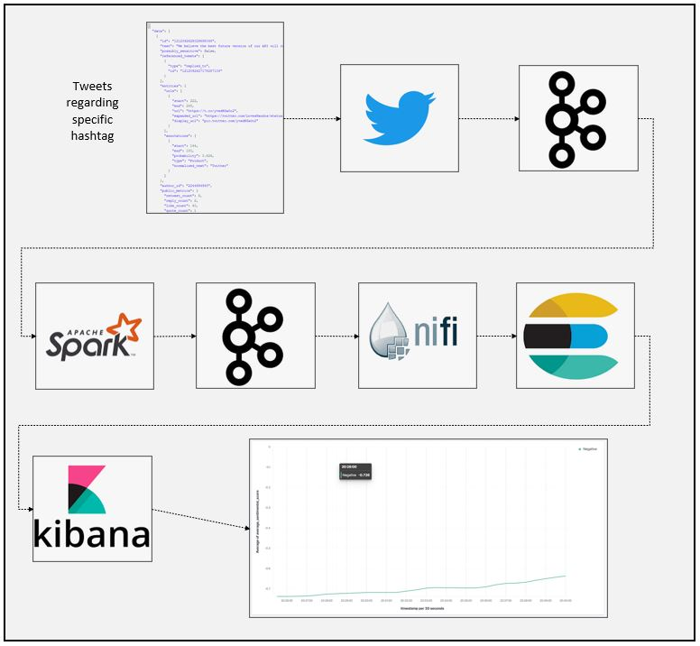
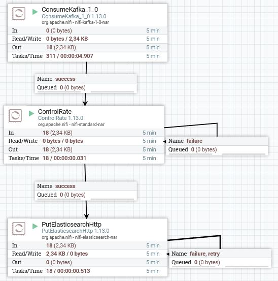
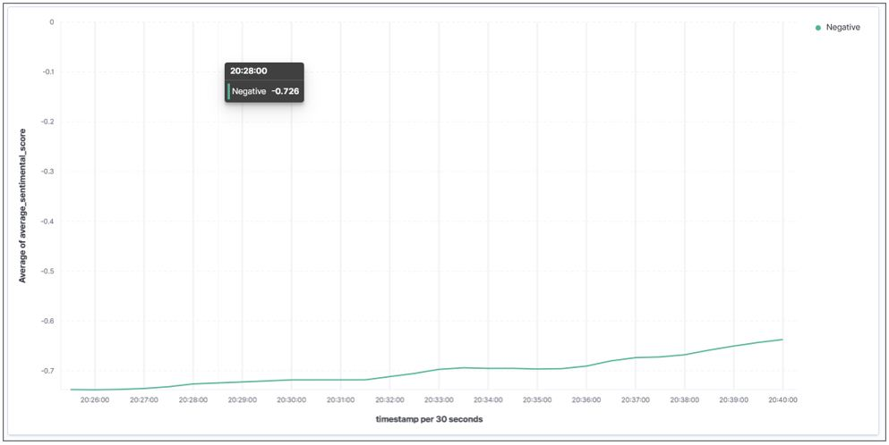

# Twitter Sentiment Analysis Using Spark Kafka Nifi Elasticsearch and Kibana
### Dataflow Pipeline


### Task List

- [x] Create twitter developer account
- [x] Install pykafka (pykafka==2.8.0)
- [x] Install tweepy (tweepy==3.10.0)
- [x] Install afinn library (pip install afinn)
- [x] Set account configurations on twitter_config.py

```
consumer_key = 'TWITTER_APP_CONSUMER_KEY'
consumer_secret = 'TWITTER_APP_CONSUMER_SECRET'
access_token = 'TWITTER_APP_ACCESS_TOKEN'
access_secret = 'TWITTER_APP_ACCESS_SECRET'
```
- [x] Import Afinn and instantiate
```
afinn = Afinn()
```
- [x] Define function to create sentimental score and extract text
```
def construct_message(jdt):
	sending_data = json.loads('{}')
	sending_data['text'] = jdt['text']
	sending_data['sentimental_score'] = afinn.score(jdt['text'])
	return json.dumps(sending_data)
```
- [x] Create kafka push class inherited from StreamListener
```
#Twitter Stream Listener
class KafkaPushListener(StreamListener):
	def __init__(self):
		#localhost:9092 = Default Zookeeper Producer Host and Port Adresses
		self.client = pykafka.KafkaClient("localhost:9092")

		#Get Producer that has topic name is Twitter
		self.producer = self.client.topics[bytes("twitter", "ascii")].get_producer()

	def on_data(self, data):
		#Producer produces data for consumer
		#Data comes from Twitter
		try:

			sending_data = construct_message(json.loads(data))
			self.producer.produce(bytes(sending_data, "ascii"))
			return True
		except KeyError:
			return True

	def on_error(self, status):
		print(status)
		return True
```
- [x] Start twitter stream
```
#Start tweetter stream
twitter_stream = Stream(auth, KafkaPushListener())
```
- [x] Set #hashtag which you want to track
```
#Produce data that filter given hashtag(Tweets)
twitter_stream.filter(languages=['en'], track=['#Turkey'])
```
- [x] Start zookeeper and kafka
- [x] Create spark session
```
    spark = SparkSession \
        .builder \
        .appName("PythonStreamingKafkaTweetSentiment") \
        .master("local[3]") \
        .config("spark.streaming.stopGracefullyOnShutdown", "true") \
        .getOrCreate()
 ```
- [x] Create schema for desired informations
```
    #Preparing schema for tweets
    schema = StructType([
    	StructField("text", StringType()),
        StructField("sentimental_score", DoubleType()),
        StructField("timestamp", StringType())
    ])
 ```
- [x] Read stream from kafka topic
```
    #Read from kafka topic named "twitter"
    kafka_df = spark.readStream \
        .format("kafka") \
        .option("kafka.bootstrap.servers", "localhost:9092") \
        .option("subscribe", "twitter") \
        .option("startingOffsets", "earliest") \
        .load()
```
- [x] Create function to evaluate sentimental score
```
    def evaluate(avg):
        try:
            if avg < 0:
                return 'Negative'
            elif avg >0:
                return 'Positive'
            else:
                return 'Neutral'
        except:
            return 'Neutral'
```
- [x] Deserialize json value from string (Because we read from Kafka)
```
value_df = kafka_df.select(from_json(col("value").cast("string"),schema).alias("value"))
```
- [x] Create structure using Spark DataFrame functions
```
    explode_df = value_df.selectExpr("value.text",
                                      "value.sentimental_score", "value.timestamp")

#Set timeParserPolicy=Legacy to parse timestamp in given format
    spark.sql("set spark.sql.legacy.timeParserPolicy=LEGACY")
#Convert string type to timestamp
    transformed_df = explode_df.select('*') \
        .withColumn("timestamp", to_timestamp(col("timestamp"), "yyyy-MM-dd HH:mm:ss"))

    transformed_df.printSchema()

    average_df = transformed_df.select(avg('sentimental_score').alias('average_sentimental_score'))


    evaluated_df = average_df.withColumn('status', eval_udf('average_sentimental_score')) \
                             .withColumn('timestamp', to_timestamp(lit(current_timestamp()))) \
                             .withColumn('date', to_date(col('timestamp')))

    evaluated_df.printSchema()

    kafka_df = evaluated_df.select("*")

    kafka_target_df = kafka_df.selectExpr("status as key",
                                                 "to_json(struct(*)) as value")

    kafka_target_df.printSchema()
```
- [x] Write stream to the kafka consumer
```
    nifi_query = kafka_target_df \
            .writeStream \
            .queryName("Notification Writer") \
            .format("kafka") \
            .option("kafka.bootstrap.servers", "localhost:9092") \
            .option("topic", "twitter2") \
            .outputMode("complete") \
            .option("checkpointLocation", "chk-point-dir") \
            .start()

    nifi_query.awaitTermination()
 ```
- [x] Create nifi pipeline to read from kafka



- [x] Put data to elasticsearch create visualization using kibana



### Code Description

To implement this project yourself you need to apply twitter developer account first. You can use [link](https://developer.twitter.com/en/apply-for-access) to submit an application. Then you can follow steps mentioned on the task list above.

kafka_tweet_producer.py is used to connect Twitter API with the Apache Kafka as well as filtering streams accourding to given hashtag. And afinn library used to create sentimental score from the text.

twitter_structured_stream_nifi_spark_kafka_elasticsearch.py  is used to create sparksession to read from Kafka topic and make necessary transformations on the data as well as evaluating sentimental score. Finally we are writing stream do kafka consumer topic

Nifi pipeline created to get kafka data and insert data to elasticsearch

Kibana used to create visualization

### Running

1. Start zookeeper (Check kafka scripts)
```
zookeeper-server-start.bat config\zookeeper.properties (zookeeper-server-start.sh for linux)
 ```
2. Start kafka (Check kafka scripts)
```
kafka-server-start.bat config\server.properties  (kafka-server-start.sh for linux)
 ```
3. Execute below code first
```
spark-submit kafka_tweet_producer.py
```
4. Execute below code
```
spark-submit --packages org.apache.spark:spark-sql-kafka-0-10_2.12:3.0.1 twitter_structured_stream_nifi_spark_kafka_elasticsearch.py
```
5. Run nifi and start processors
6. Start elasticsearch and kibana
7. Go to kibana and create visualization

Note that we added spark kafka integration package taken from maven respository, if you already added this one into your spark conf you can skip that part.
